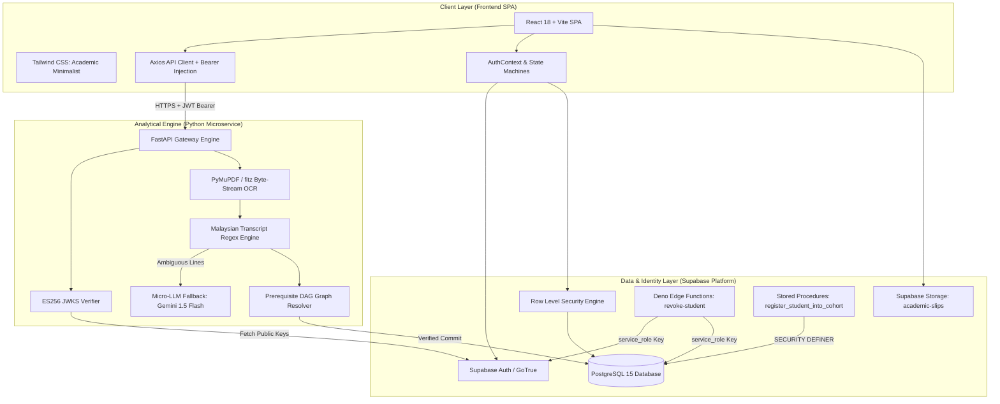
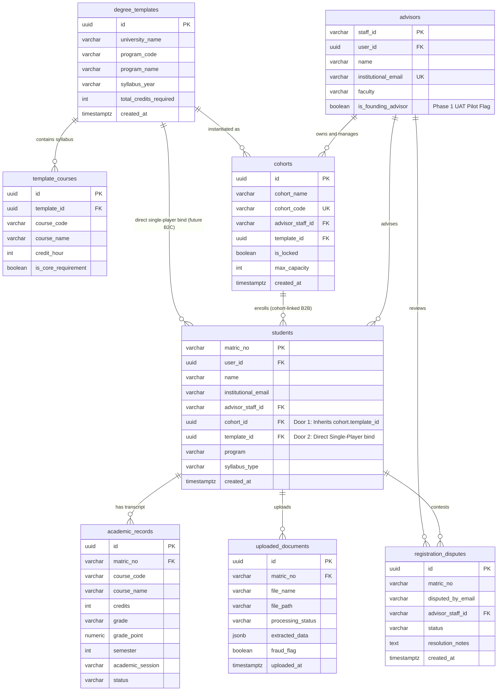
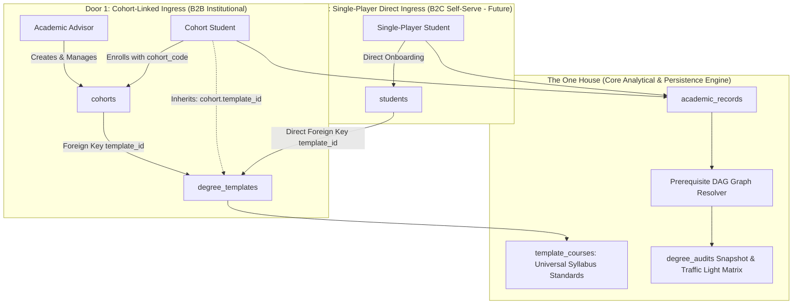
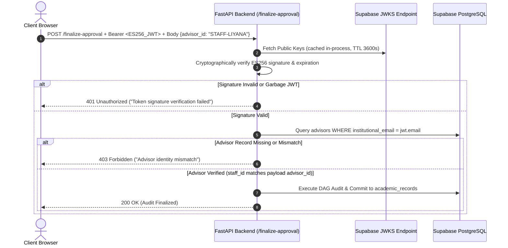
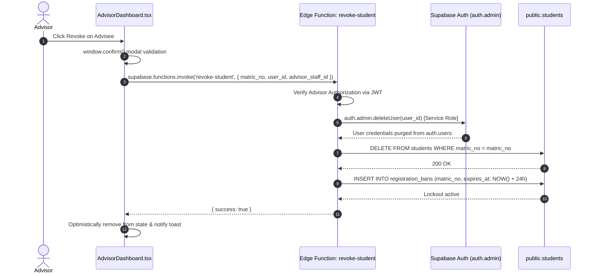

# SynGrad • Technical Architecture & Database Schema Document
## Multi-Tenant Smart Academic Advising Architecture Specification

---

### Document Metadata
* **System:** SynGrad Academic Advising Engine
* **Classification:** Architectural Design Document (ADD)
* **Author:** Principal Staff Engineer & Core Infrastructure Team
* **Status:** Active Production Specification
* **Version:** 1.0.0

---

## 0. Current State (2026-10-01) — supersedes anything below that conflicts

Sections 1–5 were written at v1.0.0 and are partly outdated (e.g. `registration_disputes`, contest flow, `register_student_into_cohort` RPC, `revoke-student`). Trust this section and `supabase/migrations/` over them.

### 0.1 Model
- Multi-university. Every row is scoped by `tenant_id` (TEXT, e.g. `'UTM'`). No faculty layer: advisor ↔ student only.
- Nothing university-specific is hardcoded in code or CHECK constraints. It lives in `tenants`, `grade_scales`, templates.

### 0.2 Key tables
| Table | Notes |
|---|---|
| `tenants` | `student_email_domains[]`, `matric_regex`, `min_pass_grade`, `default_prereq_min_grade`, `repeat_policy` (`latest`/`best`/…), `slip_profile` ('utm' vs NULL for universal AI reader) |
| `grade_scales` | per tenant: grade, point, min/max mark, `is_pass`, `achievement_label`; special codes (HL, EX, CT, TD, TS). Presets in `grade_scale_presets`, `clone_preset_to_tenant()` |
| `advisor_invites` | invite codes for advisor registration |
| `advisors`, `students` | identity columns protected by triggers; `students.matric_no` currently globally unique (blocks same matric at two tenants — fix before 2nd university) |
| `cohorts` | cohort code → template; students join with code |
| `degree_templates`, `template_courses` | tenant-scoped curriculum; `degree_templates.owner_staff_id` (mig 34) enforces uploader-only editing; `template_courses.updated_at`; elective slots = code containing `/` or `XX`, auto-numbered, `match_patterns`; partial unique index on real courses only |
| `academic_records` | one row per attempt, unique `(tenant_id, matric_no, course_code, semester)`; semester normalised `SEM n YYYY/YYYY`; tenant `repeat_policy` picks the counted attempt |
| `uploaded_documents` | slip metadata, `extracted_data` incl. server-side `original_courses`, `processing_status`, fraud flag; browser cannot write status/results (mig 29) |
| `advising_logs` | advisor notes, student can read own; `created_at`/matric/advisor locked on UPDATE; notification sent-at for rate limit |
| `degree_audits` | audit snapshots; read: own student or own advisor (mig 30) |
| `elective_assignments` | manual elective overrides (mig 33): assign/exclude, unique (tenant, matric, course), partial unique on slot for assign |
| `exemption_audit` | exemption history |
| view `advisee_roster_summary` | `security_invoker = true`; CGPA/credits computed from tenant grade scale |

### 0.3 RLS model
- SECURITY DEFINER helpers (avoid policy recursion): `my_staff_ids()`, `my_advisor_staff_ids()`, `my_matric_nos()`, `my_advisee_matric_nos()`, `my_tenant_id()`.
- Students see their own rows; advisors see their advisees' rows; anon sees nothing.
- Identity-protect triggers bypass only when there are no JWT claims (SQL editor) or role = `service_role`.
- Storage `academic-slips` (mig 30): private bucket; INSERT only to `slips/<own matric>_<ts>.<ext>`; SELECT only for paths present in `uploaded_documents` rows the user can see. Advisors view via signed URL (1h).

### 0.4 Identity
- Backend verifies Supabase JWT via JWKS (ES256). `advisor_id`, `tenant_id`, `matric_no` come from the JWT/app_metadata or a DB lookup, never the request body.
- Role + tenant written to `app_metadata` by `/register/*` (service role).

### 0.5 API (prefix `/api/v1`)
| Endpoint | Who | Purpose |
|---|---|---|
| `GET /health` | public | health: `{status, environment}` only (also used as Render wake-up ping) |
| `POST /register/student` | new user | cohort code + matric + name; matric checked against `tenants.matric_regex` |
| `POST /register/advisor` | new user | invite code |
| `GET /register/validate-cohort/{code}` | public | cohort lookup |
| `POST /courses/upload-csv` | advisor | curriculum template upload; sets `owner_staff_id` from advisor JWT |
| `GET /courses/template-csv` | advisor | blank template download |
| `GET /courses/templates` | advisor | list tenant templates with `can_edit` ownership flag |
| `GET /courses/templates/{id}` | advisor | template detail and sorted course rows |
| `PATCH /courses/templates/{id}` | advisor (owner) | update template program name or required credits |
| `POST /courses/templates/{id}/rows` | advisor (owner) | add row to template (reuses shared row validator) |
| `PATCH /courses/templates/{id}/rows/{row_id}` | advisor (owner) | edit template row (reuses shared row validator) |
| `DELETE /courses/templates/{id}/rows/{row_id}` | advisor (owner) | delete row, cascades elective overrides, renumbers slots |
| `GET /courses/templates/{id}/rows/{row_id}/impact` | advisor | calculate deletion impact (`overrides_count`, `cohorts_using_template`) |
| `POST /audit/extract` | student/advisor (owner) | parse slip: rules first if tenant.slip_profile == 'utm' and confident (semester+session+courses+no unparsed); otherwise universal AI reader (ONE LLM call); pure guardrails check both; saves results server-side |
| `POST /audit/submit-verification` | student | confirm/edit rows; server computes `is_altered` vs `original_courses` |
| `POST /audit/finalize-approval` | advisor (own advisee) | write `academic_records` (supports per-course `session_semester` for multi-semester transcripts) |
| `POST /audit/reject-document` | advisor (own advisee) | reject |
| `POST /audit/purge-document` | backend | PDPA purge |
| `POST /advising-logs/{log_id}/notify` | advisor | email student via Resend; no note text in email; 1/student/hour |
| `PATCH /students/{matric_no}/exemptions` | advisor | exemptions |
| `GET /audit/progress/{matric_no}` | student (own) / advisor (advisee) | compute progress against degree template (4A & 4B) |
| `PUT /audit/progress/{matric_no}/overrides` | advisor (advisee only) | set elective override (kind='assign' or 'exclude') |
| `DELETE /audit/progress/{matric_no}/overrides/{course_code}` | advisor (advisee only) | remove elective override (restores auto) |

`document_id`/`file_path` access goes through `_load_authorized_document()` in `audit.py`.

### 0.6 Slip parsing (Rules vs Universal AI Reader & Guardrails)
- Zero-Waste execution: `tenants.slip_profile == 'utm'` triggers deterministic rule regex parser first.
- If confident (semester and session detected, >=1 course parsed, 0 unparsed candidate lines), uses `source='rules'`.
- If not confident or tenant has no rule profile (`slip_profile IS NULL`), routes to universal reader `source='ai'` (ONE LLM call to Groq/OpenAI client, JSON mode, temperature 0, 1 retry, input cap).
- Pure guardrails (`engine/slip_validation.py`): grade in tenant scale, credits > 0 (decimal flagged), course code sanity, semester normalisation, recomputed GPA vs printed (tolerance 0.01), matric slip vs expected match (blocking warning "This slip may belong to someone else"). Guardrails never alter values; return warnings + needs_review.
- Multi-semester transcripts: each course carries its own `session_semester` label preserved across verification and approval to persist attempts under their respective academic semesters.
- Scanned slips without text layer return HTTP 422 ("Scanned slips aren't supported yet — please upload the original PDF from your student portal.").

### 0.7 Migrations (applied in order; never edit after applied)
01–16 legacy (written against a drifted DB; staging is built from a prod schema dump instead). 17 tenant curriculum · 18 tenants · 19 advisor_invites · 20 RLS lockdown · 21 drop email advisor policies · 22 elective slots · 23 cohorts lockdown · 24 advising_logs v2 · 25 advising notifications · 26 grading scales · 27 record attempts · 28 roster view · 29 uploaded_documents lockdown · 30 storage + degree_audits RLS (**apply after push**). 31 template_courses category · 32 template_courses course_code text · 33 elective_assignments (4B) · 34 template_owner & auditing (4C) · 35 progress_indexes · 36 tenant_slip_profile (Universal slip reader foundation). From 30 on: apply to staging first, then prod.

### 0.8 Known gaps
- `DegreeAuditView.tsx` has a UTM course-prefix regex. Old contest-registration code may remain in auth pages. `students.matric_no` global unique. Render free tier cold starts.

---

## 1. Technology Stack & Topology

SynGrad is engineered around a hybrid cloud architecture combining a high-performance, single-page application (SPA), a managed backend-as-a-service (BaaS) for persistence and authentication, and an asynchronous analytical Python microservice for computer vision, natural language processing, and Directed Acyclic Graph (DAG) graph resolution.



### Component Breakdown

| Layer | Technology | Primary Responsibilities | Key File References |
| :--- | :--- | :--- | :--- |
| **Client Frontend** | React 18, Vite, React Router v7, Tailwind CSS | High-density institutional advising dashboards, real-time regex form validation, student transcript staging, advisor surveillance tables. | [`src/app/App.tsx`](file:///d:/smart-aa-system/src/app/App.tsx), [`src/app/routes.tsx`](file:///d:/smart-aa-system/src/app/routes.tsx), [`StudentAuth.tsx`](file:///d:/smart-aa-system/src/pages/auth/StudentAuth.tsx), [`AdvisorDashboard.tsx`](file:///d:/smart-aa-system/src/app/pages/advisor/AdvisorDashboard.tsx) |
| **Authentication & Client Gateway** | Supabase Auth (GoTrue), Supabase JS Client | JWT session persistence, auto-refresh tokens, client cache invalidation, and bearer token attachment. | [`src/context/AuthContext.tsx`](file:///d:/smart-aa-system/src/context/AuthContext.tsx), [`src/lib/supabase.ts`](file:///d:/smart-aa-system/src/lib/supabase.ts), [`src/lib/api.ts`](file:///d:/smart-aa-system/src/lib/api.ts) |
| **Database & Identity Gateway** | Supabase PostgreSQL 15 | Relational data persistence, Row Level Security (RLS) tenancy enforcement, immutable degree blueprints, registration disputes. | [`supabase/migrations/`](file:///d:/smart-aa-system/supabase/migrations) |
| **Privileged Execution Layer** | Supabase Edge Functions (Deno runtime) | Privileged user deletion bypassing RLS with `service_role` secret to prevent orphaned auth records and enforce registration bans. | Edge Function: `revoke-student` |
| **Analytical & Audit Backend** | FastAPI, Python 3.12, Uvicorn, PyMuPDF, NetworkX | Fast byte-stream PDF extraction, Malaysian transcript pattern matching, prerequisite DAG resolution, ES256 JWKS verification. | [`backend/app/main.py`](file:///d:/smart-aa-system/backend/app/main.py), [`backend/app/core/auth.py`](file:///d:/smart-aa-system/backend/app/core/auth.py), [`backend/app/v1/endpoints/audit.py`](file:///d:/smart-aa-system/backend/app/v1/endpoints/audit.py) |
| **Micro-LLM Fallback** | Gemini 1.5 Flash (via Groq / OpenAI-compatible client) | High-accuracy zero-temperature line-item extraction for ambiguous transcript rows failing strict regex parsing. | [`backend/app/engine/llm_fallback.py`](file:///d:/smart-aa-system/backend/app/engine/llm_fallback.py) |

---

## 2. Multi-Tenant Blueprint Database Schema

The core architectural breakthrough in SynGrad is the **Multi-Tenant Blueprint Architecture** introduced in Migration `08_multi_tenant_blueprint_architecture.sql`. This separates universal curriculum standards from individual advisor cohorts, preventing syllabus versioning errors.

### 2.1 Entity-Relationship (ER) Diagram



---

### 2.2 Core Table Specifications (DDL & Constraints)

#### 1. `degree_templates` (Immutable University Program Blueprints)
Defines the canonical requirements for a university degree program. Immutable once deployed; versions are preserved by year.

```sql
CREATE TABLE degree_templates (
    id UUID PRIMARY KEY DEFAULT gen_random_uuid(),
    university_name VARCHAR(255) NOT NULL DEFAULT 'Universiti Teknologi Malaysia',
    program_code VARCHAR(50) NOT NULL, -- e.g. 'SECJ'
    program_name VARCHAR(255) NOT NULL, -- e.g. 'Software Engineering'
    syllabus_year VARCHAR(50) NOT NULL, -- e.g. '2024/2025'
    total_credits_required INT NOT NULL DEFAULT 130,
    created_at TIMESTAMPTZ NOT NULL DEFAULT NOW(),
    updated_at TIMESTAMPTZ NOT NULL DEFAULT NOW(),
    CONSTRAINT uq_degree_templates_univ_prog_year UNIQUE (university_name, program_code, syllabus_year)
);

CREATE INDEX idx_degree_templates_lookup 
ON degree_templates(university_name, program_code, syllabus_year);
```

#### 2. `template_courses` (Curriculum Syllabus per Blueprint)
The course structure tied to a specific `degree_templates` blueprint. Deleted automatically if a template is purged.

```sql
CREATE TABLE template_courses (
    id UUID PRIMARY KEY DEFAULT gen_random_uuid(),
    template_id UUID NOT NULL REFERENCES degree_templates(id) ON DELETE CASCADE,
    course_code VARCHAR(50) NOT NULL, -- e.g. 'SECJ1013'
    course_name VARCHAR(255) NOT NULL, -- e.g. 'Programming Technique I'
    credit_hour INT NOT NULL DEFAULT 3,
    is_core_requirement BOOLEAN NOT NULL DEFAULT true,
    created_at TIMESTAMPTZ NOT NULL DEFAULT NOW(),
    CONSTRAINT uq_template_courses_template_course UNIQUE (template_id, course_code)
);

CREATE INDEX idx_template_courses_template_id ON template_courses(template_id);
CREATE INDEX idx_template_courses_course_code ON template_courses(course_code);
```

#### 3. `cohorts` (The Tinkercad Gateway Table)
Connects an Academic Advisor to an immutable `degree_templates` row via a 6-character registration code.

```sql
CREATE TABLE cohorts (
    id UUID PRIMARY KEY DEFAULT gen_random_uuid(),
    cohort_name VARCHAR(255) NOT NULL,
    cohort_code VARCHAR(8) NOT NULL UNIQUE, -- e.g. 'ABC-123'
    advisor_staff_id VARCHAR(50) NOT NULL REFERENCES advisors(staff_id) ON DELETE CASCADE,
    template_id UUID NOT NULL REFERENCES degree_templates(id) ON DELETE RESTRICT,
    is_locked BOOLEAN NOT NULL DEFAULT false,
    max_capacity INT NOT NULL DEFAULT 50,
    created_at TIMESTAMPTZ NOT NULL DEFAULT NOW(),
    updated_at TIMESTAMPTZ NOT NULL DEFAULT NOW()
);

CREATE INDEX idx_cohorts_advisor ON cohorts(advisor_staff_id);
CREATE INDEX idx_cohorts_code ON cohorts(cohort_code);
CREATE INDEX idx_cohorts_template ON cohorts(template_id);
```

#### 4. `students` (Advisee Records)
Enforces a strict UTM matric regex constraint. Primary key is the institutional matric number.

```sql
CREATE TABLE students (
    matric_no VARCHAR(20) PRIMARY KEY CHECK (matric_no ~* '^[A-Z]\d{2}[A-Z]{2}\d{4}$'),
    user_id UUID REFERENCES auth.users(id) ON DELETE SET NULL,
    name VARCHAR(255) NOT NULL,
    institutional_email VARCHAR(255),
    advisor_staff_id VARCHAR(50) REFERENCES advisors(staff_id) ON DELETE SET NULL,
    cohort_id UUID REFERENCES cohorts(id) ON DELETE SET NULL,
    program VARCHAR(50) NOT NULL,
    syllabus_type VARCHAR(50) NOT NULL,
    created_at TIMESTAMPTZ NOT NULL DEFAULT NOW(),
    updated_at TIMESTAMPTZ NOT NULL DEFAULT NOW()
);

CREATE INDEX idx_students_cohort ON students(cohort_id);
CREATE INDEX idx_students_advisor ON students(advisor_staff_id);
CREATE INDEX idx_students_user_id ON students(user_id);
```

#### 5. `registration_disputes` (Loose Admission Safety Net)
Enables unauthenticated students to dispute an already-registered matric number.

```sql
CREATE TABLE registration_disputes (
    id UUID PRIMARY KEY DEFAULT gen_random_uuid(),
    matric_no VARCHAR(20) NOT NULL,
    disputed_by_email VARCHAR(255) NOT NULL,
    advisor_staff_id VARCHAR(50),
    status VARCHAR(20) NOT NULL DEFAULT 'open' CHECK (status IN ('open', 'resolved', 'rejected')),
    resolution_notes TEXT,
    created_at TIMESTAMPTZ NOT NULL DEFAULT NOW(),
    updated_at TIMESTAMPTZ NOT NULL DEFAULT NOW()
);

CREATE INDEX idx_registration_disputes_matric ON registration_disputes(matric_no);
CREATE INDEX idx_registration_disputes_advisor ON registration_disputes(advisor_staff_id);
```

---

### 2.2 The "Two Doors, One House" Dual-Ingress Architecture (B2B2C Model)

SynGrad is engineered around a unified **"Two Doors, One House"** dual-ingress data architecture. This model enables seamless coexistence between institutional, cohort-led advising (B2B) and direct student self-serve progression auditing (B2C) without duplicating graduation audit logic or database structures.



#### Dual-Ingress Specifications

| Ingress Path | Target Persona | Blueprint Resolution Mechanism | Governance & Access Control |
| :--- | :--- | :--- | :--- |
| **Door 1: Cohort-Linked (B2B)** | Advisees assigned to an official university lecturer. | **Indirect Inheritance:** Student record stores `cohort_id`. The degree blueprint is resolved via `cohorts.template_id` (`students.cohort_id -> cohorts.id -> cohorts.template_id`). | The cohort's advisor controls registration capacity, lock toggles (`is_locked`), student surveillance, and transcript approval queues. |
| **Door 2: Single-Player (B2C - Roadmap)** | Independent students using SynGrad for self-guided degree audits. | **Direct Binding:** Student record stores a nullable direct foreign key `students.template_id REFERENCES degree_templates(id)`. | Self-serve access governed directly by student auth, without advisor gatekeeping or cohort lock constraints. |
| **The One House** | Both Student Categories | **Shared Analytical Core:** Both ingress doors converge into the identical prerequisite DAG engine, Malaysian transcript regex parser, PyMuPDF extraction, and forensic tamper provenance tracking. | Zero duplicate schemas. Both doors write to `academic_records` and generate identical `degree_audits` snapshots. |

---

## 3. Security Architecture & Boundary Verification

### 3.1 Supabase Row Level Security (RLS) Boundaries

All institutional tables enforce PostgreSQL Row Level Security (`ENABLE ROW LEVEL SECURITY` and `FORCE ROW LEVEL SECURITY`).

```mermaid
graph TD
    UserRequest[Incoming Client Request] --> AuthCheck{auth.jwt() Present?}
    AuthCheck -->|No (Anon Role)| AnonCheck{Target Table & Action}
    AnonCheck -->|SELECT cohorts WHERE is_locked=false| AllowAnonSelect[Allow Unlocked Cohort Lookup]
    AnonCheck -->|INSERT registration_disputes| AllowAnonInsert[Allow Dispute Filing]
    AnonCheck -->|All Other Tables| DenyAnon[Deny Access - 401/403]

    AuthCheck -->|Yes (Authenticated)| RoleCheck{Is Student or Advisor?}
    RoleCheck -->|Student: user_id = auth.uid()| StudentRLS[Read Own Student & Academic Records Only]
    RoleCheck -->|Advisor: institutional_email matches JWT| AdvisorRLS[Manage Own Cohorts, Advisees & Disputes]
```

#### RLS Policy Definitions

| Table | Policy Name | Permitted Role | Operation | Predicate (USING / WITH CHECK) |
| :--- | :--- | :--- | :--- | :--- |
| `degree_templates` | Public Read Blueprints | `anon`, `authenticated` | `SELECT` | `true` |
| `template_courses` | Public Read Courses | `anon`, `authenticated` | `SELECT` | `true` |
| `cohorts` | Public Unlocked Cohorts | `anon`, `authenticated` | `SELECT` | `is_locked = false` |
| `cohorts` | Advisor Manage Cohorts | `authenticated` | `ALL` | `advisor_staff_id IN (SELECT staff_id FROM advisors WHERE institutional_email = (auth.jwt()->>'email') OR user_id = auth.uid())` |
| `students` | Student Read Self | `authenticated` | `SELECT` | `user_id = auth.uid() OR institutional_email = (auth.jwt()->>'email')` |
| `students` | Advisor Read Cohort | `authenticated` | `SELECT` | `advisor_staff_id IN (SELECT staff_id FROM advisors WHERE institutional_email = (auth.jwt()->>'email'))` |
| `registration_disputes` | Anon Dispute Filing | `anon`, `authenticated` | `INSERT` | `true` |
| `registration_disputes` | Advisor Dispute Review | `authenticated` | `SELECT`, `UPDATE` | `advisor_staff_id IN (SELECT staff_id FROM advisors WHERE institutional_email = (auth.jwt()->>'email'))` |

---

### 3.2 Strict JWT Signature Verification Linked to DB Constraints (`backend/app/core/auth.py`)

To guarantee zero-trust identity isolation across microservices, the FastAPI analytical backend does **not** rely on static shared secrets (HS256). Instead, it implements **strict JWT signature verification linked to DB constraints** using the Elliptic Curve `ES256` asymmetric algorithm and live cryptographic key sets.



#### 1. Asymmetric ES256 JWKS Verification
Session tokens issued by Supabase Auth are signed with project-specific asymmetric private keys. The backend verifies incoming tokens against the public JSON Web Key Set at:
```
https://<project-ref>.supabase.co/auth/v1/.well-known/jwks.json
```
Tokens with invalid crypto padding, altered payloads, or expired signatures are rejected immediately with `401 Unauthorized` before any application logic or database queries execute.

#### 2. Database Identity Linkage (`_check_advisor_identity`)
Cryptographic validity alone does not prevent parameter tampering (e.g. Lecturer A using their valid token to submit approvals for Lecturer B's advisees). On every mutating request:
1. The backend extracts `jwt_payload["email"]`.
2. It queries `public.advisors` to verify the staff record:
   ```python
   res = supabase_svc.client.table("advisors") \
       .select("staff_id") \
       .eq("institutional_email", jwt_email) \
       .maybe_single() \
       .execute()
   ```
3. It asserts `actual_staff_id == claimed_advisor_id`. If an impersonation attempt is detected, the request is rejected with `403 Forbidden ("Advisor identity mismatch")`.

---

### 3.3 Hard Client-Side Session Invalidation Encompassing Storage and Cookies

In multi-user campus environments (shared computer lab terminals, advisor department workstations), client-side session termination must be absolute to prevent session replay and token leakage.

SynGrad implements **hard client-side session invalidation encompassing storage and cookies** across five sequential enforcement steps in [`AuthContext.tsx`](file:///d:/smart-aa-system/src/context/AuthContext.tsx):

```typescript
const signOut = async () => {
  try {
    setIsLoading(true);
    // 1. Invalidate Supabase GoTrue Auth Session on Server
    await supabase.auth.signOut();
  } catch (err) {
    console.error('[AuthContext] SignOut error:', err);
  } finally {
    // 2. Hard Purge ALL Local Storage (JWTs, cached profiles, role state)
    localStorage.clear();

    // 3. Hard Purge ALL Session Storage (in-flight staging data, transient keys)
    sessionStorage.clear();

    // 4. Hard Expire and Purge ALL Accessible Browser Cookies
    document.cookie.split(";").forEach((c) => {
      document.cookie = c
        .replace(/^ +/, "")
        .replace(/=.*/, "=;expires=" + new Date().toUTCString() + ";path=/");
    });

    setIsLoading(false);

    // 5. Hard Navigation Redirect to flush in-memory JavaScript/React state
    window.location.href = '/';
  }
};
```

This ensures that:
- Stored session tokens cannot be retrieved via browser inspection or script injection after logout.
- In-flight form state and staging caches are purged from volatile memory.
- A full window reload flushes React component state machines, preventing back-navigation leakage.

---

### 3.4 Atomic Registration RPC (`register_student_into_cohort`)

To prevent registration race conditions where multiple students oversubscribe a cohort or claim duplicate matric numbers concurrently, student enrollment is handled via an atomic PostgreSQL function executing with `SECURITY DEFINER`:

```sql
CREATE OR REPLACE FUNCTION register_student_into_cohort(
    p_matric_no TEXT,
    p_full_name TEXT,
    p_email TEXT,
    p_cohort_code TEXT,
    p_user_id UUID
)
RETURNS JSONB
LANGUAGE plpgsql
SECURITY DEFINER
AS $$
DECLARE
    v_cohort RECORD;
    v_template RECORD;
    v_current_count INT;
BEGIN
    -- 1. Format validation
    IF p_matric_no !~* '^[A-Z]\d{2}[A-Z]{2}\d{4}$' THEN
        RAISE EXCEPTION 'Invalid matric format. Expected format: A24CS0001'
            USING ERRCODE = '22000';
    END IF;

    -- 2. Lock cohort row for update to prevent concurrent capacity race condition
    SELECT * INTO v_cohort
    FROM cohorts
    WHERE cohort_code = UPPER(TRIM(p_cohort_code))
    FOR UPDATE;

    IF NOT FOUND OR v_cohort.is_locked = true THEN
        RAISE EXCEPTION 'Invalid or locked Cohort Code.'
            USING ERRCODE = '22023';
    END IF;

    -- 3. Check capacity
    SELECT COUNT(*) INTO v_current_count
    FROM students
    WHERE cohort_id = v_cohort.id;

    IF v_current_count >= v_cohort.max_capacity THEN
        RAISE EXCEPTION 'Cohort has reached maximum capacity.'
            USING ERRCODE = '23514';
    END IF;

    -- 4. Extract degree template metadata
    SELECT * INTO v_template
    FROM degree_templates
    WHERE id = v_cohort.template_id;

    -- 5. Insert student record atomically
    INSERT INTO students (
        matric_no, user_id, name, institutional_email,
        advisor_staff_id, cohort_id, program, syllabus_type
    ) VALUES (
        UPPER(TRIM(p_matric_no)), p_user_id, TRIM(p_full_name), LOWER(TRIM(p_email)),
        v_cohort.advisor_staff_id, v_cohort.id, v_template.program_code, v_template.syllabus_year
    );

    RETURN jsonb_build_object(
        'success', true,
        'matric_no', p_matric_no,
        'cohort_name', v_cohort.cohort_name,
        'program', v_template.program_code
    );
END;
$$;
```

---

### 3.4 Privileged Revocation Edge Function (`revoke-student`)

Because client tokens and standard advisor logins are bounded by RLS, deleting a user from `auth.users` requires a privileged execution environment. SynGrad implements this via the `revoke-student` Supabase Edge Function:



---

## 4. API Surface & Contract Specifications

### 4.1 FastAPI Degree Audit Service

All endpoints require `Authorization: Bearer <SUPABASE_JWT>` verified against JWKS.

```
POST /api/v1/audit/process-storage
Headers:
  Authorization: Bearer <JWT>
Body:
  {
    "storage_path": "academic-slips/A24CS0001/slip_sem1.pdf",
    "advisor_id": "STAFF-LIYANA",
    "university_id": "UTM",
    "matric_number": "A24CS0001"
  }
Response (200 OK):
  DegreeAuditResponse
```

```
POST /api/v1/audit/extract
Headers:
  Authorization: Bearer <JWT>
Body:
  {
    "storage_path": "academic-slips/A24CS0001/slip_sem1.pdf",
    "advisor_id": "STAFF-LIYANA"
  }
Response (200 OK):
  ExtractPDFResponse: {
    "student_name": "ALEX TAN",
    "matric_number": "A24CS0001",
    "academic_session": "2024/2025",
    "semester": 1,
    "courses": [
      {
        "course_code": "SECJ1013",
        "course_name": "Programming Technique I",
        "credits": 3,
        "grade": "A",
        "grade_point": 4.0,
        "status": "Passed"
      }
    ]
  }
```

```
POST /api/v1/audit/finalize-approval
Headers:
  Authorization: Bearer <JWT>
Body:
  {
    "document_id": "8f3b2a1c-...",
    "matric_number": "A24CS0001",
    "student_name": "Alex Tan",
    "advisor_id": "STAFF-LIYANA",
    "academic_session": "2024/2025",
    "semester": 1,
    "courses": [...]
  }
Response (200 OK):
  FinalizeApprovalResponse: {
    "status": "success",
    "committed_count": 5,
    "matric_number": "A24CS0001"
  }
```

---

## 5. Deployment Topology & Operational Boundaries

```
[Vercel / Cloudflare Pages] ── HTTPS ──> [React 18 SPA Frontend]
                                                │
                                  ┌─────────────┴─────────────┐
                                  ▼                           ▼
                        [Supabase Cloud Platform]     [Render Web Service]
                        - GoTrue Auth (JWKS)          - FastAPI / Python 3.12
                        - PostgreSQL 15 Database      - PyMuPDF / NetworkX
                        - Edge Functions (Deno)       - Gemini 1.5 Flash Micro-LLM
                        - S3-Compatible Storage
```
